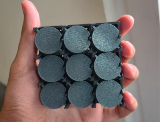

# Open-FlipDisk

An open source flip-disk module + display, which you can build on your own with a couple of components. 

I decided to build this because it's really hard to find them these days, there's only one well known seller ie- [AlfaZeta](https://flipdots.com/en/home/) (their flipdots are REALLY polished + well engineered) but they're too expensive for me to purchase. hence, I started my own reasearch, took some inspiration from [@LarryBuilds](https://www.youtube.com/@larry-builds) (really cool guy), and hence working on this now!

this is a rough 3d print that i have so far:

